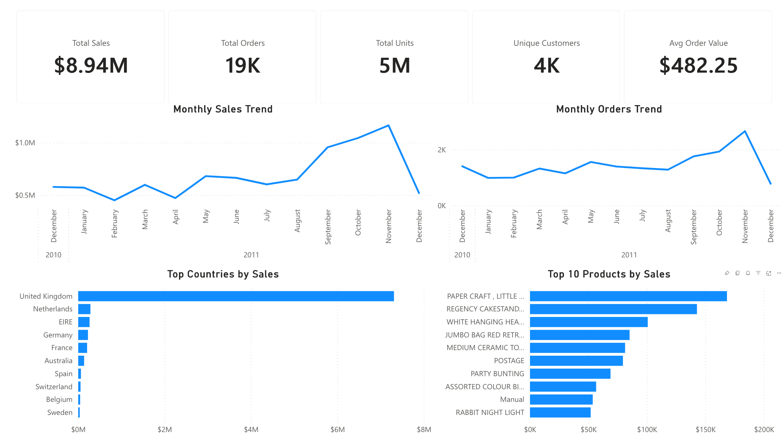
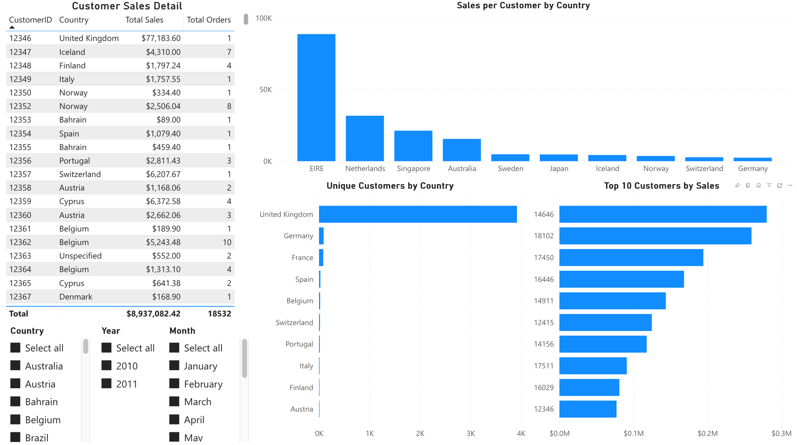
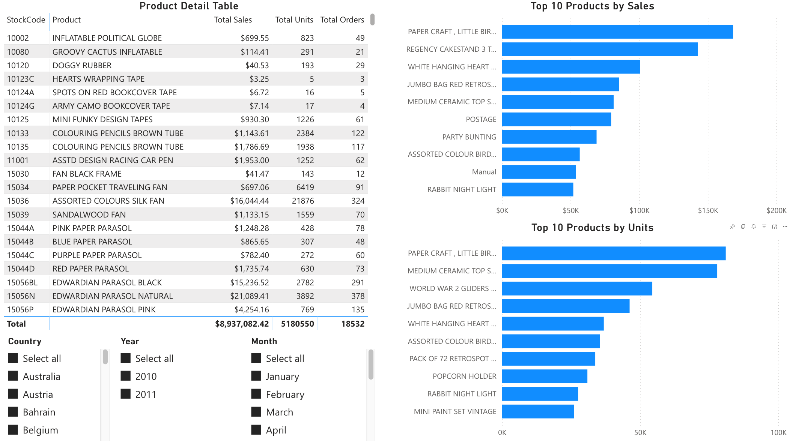
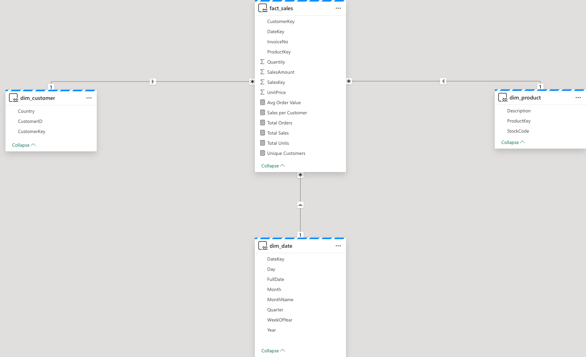

# Retail Sales Command Center in Microsoft Fabric

## Overview
This project is an end-to-end retail analytics solution built in **Microsoft Fabric** using a **Lakehouse**, **Notebook**, **Warehouse**, **semantic model**, and **Power BI report**. The goal was to take raw transaction data, clean and transform it through a medallion architecture, model it into a star schema, and deliver interactive dashboards for executive, customer, and product analysis.

The project uses the **UCI Online Retail dataset**, a real-world transactional dataset containing over **541,000** retail records from a UK-based online retailer. The final solution provides visibility into sales trends, customer behavior, geography, and product performance.

---

---

## Business Problem
Retail businesses need a centralized analytics platform to monitor sales performance, customer activity, and product demand. Raw transaction data is often not structured for direct reporting, so analysts must transform it into a reliable, business-ready model.

This project was designed to answer questions such as:
- How are sales trending over time?
- Which countries and customers generate the most revenue?
- Which products are top performers by revenue and units sold?
- How can raw retail transaction data be structured for scalable analytics in Microsoft Fabric?

---

## Dataset
**Source:** UCI Online Retail dataset

The dataset contains transactional retail data with the following fields:
- `InvoiceNo`
- `StockCode`
- `Description`
- `Quantity`
- `InvoiceDate`
- `UnitPrice`
- `CustomerID`
- `Country`

### Notes on the dataset
- Includes more than **541,909 raw rows**
- Covers transactions across **2010–2011**
- Contains cancellations, returns, missing customer IDs, and invalid values that required cleaning
- Does not include profit, so the project focuses on **sales, customer behavior, product demand, and geography**

---

## Tools Used
- **Microsoft Fabric**
  - Lakehouse
  - Notebook (PySpark)
  - Warehouse
  - Power BI semantic model
  - Power BI report
- **PySpark**
- **SQL**
- **DAX**

---

## Architecture
The project follows a **Bronze / Silver / Gold** medallion architecture.

### Bronze
Raw source data loaded into the Fabric Lakehouse:
- `bronze_online_retail`

### Silver
Cleaned and standardized Lakehouse tables:
- `silver_sales`
- `silver_customers`
- `silver_products`
- `silver_date`

### Gold
Warehouse star schema for analytics:
- `fact_sales`
- `dim_customer`
- `dim_product`
- `dim_date`

### Semantic / Reporting Layer
- `sm_retail_sales` semantic model
- Power BI report with 3 dashboard pages

---

## Data Pipeline

### 1. Ingestion
The raw dataset was uploaded into the Fabric Lakehouse and stored as a Bronze table:
- `bronze_online_retail`

### 2. Cleaning and Standardization
A Fabric notebook using **PySpark** was used to:
- cast columns into the correct data types
- convert `InvoiceDate` into timestamp format
- remove rows with:
  - negative quantities
  - zero or negative prices
  - missing customer IDs
  - missing descriptions
  - cancelled invoices (`InvoiceNo` starting with `C`)
- create a new measure:
  - `SalesAmount = Quantity * UnitPrice`

### 3. Silver Table Creation
The cleaned transaction table was saved as:
- `silver_sales`

Dimension-style tables were created from the cleaned sales data:
- `silver_customers`
- `silver_products`
- `silver_date`

### 4. Gold Warehouse Modeling
Using SQL in the Fabric Warehouse, I created a star schema:
- `fact_sales`
- `dim_customer`
- `dim_product`
- `dim_date`

Surrogate keys were generated with `ROW_NUMBER()` and used to connect fact and dimension tables.

### 5. Semantic Model and Reporting
A semantic model was built on top of the Gold warehouse tables. Relationships were created between:
- `fact_sales[CustomerKey] -> dim_customer[CustomerKey]`
- `fact_sales[ProductKey] -> dim_product[ProductKey]`
- `fact_sales[DateKey] -> dim_date[DateKey]`

DAX measures were then added for KPIs and dashboard reporting.

---

## Data Model
The final warehouse model uses a **star schema**.

### Fact Table
**`fact_sales`**
- `SalesKey`
- `InvoiceNo`
- `CustomerKey`
- `ProductKey`
- `DateKey`
- `Quantity`
- `UnitPrice`
- `SalesAmount`

### Dimension Tables

**`dim_customer`**
- `CustomerKey`
- `CustomerID`
- `Country`

**`dim_product`**
- `ProductKey`
- `StockCode`
- `Description`

**`dim_date`**
- `DateKey`
- `FullDate`
- `Year`
- `Quarter`
- `Month`
- `MonthName`
- `WeekOfYear`
- `Day`

---

## Key Measures
The DAX measures created in the semantic model include:

- `Total Sales`
- `Total Units`
- `Total Orders`
- `Avg Order Value`
- `Unique Customers`
- `Sales per Customer`

These measures power the report visuals and KPI cards.

---

## Dashboard Pages

### 1. Executive Overview
This page provides a high-level business summary with:
- Total Sales
- Total Orders
- Total Units
- Unique Customers
- Avg Order Value
- Monthly Sales Trend
- Monthly Orders Trend
- Sales by Country
- Top 10 Products by Sales

### 2. Customer & Geography Analysis
This page focuses on customer concentration and geographic performance:
- Customer Sales Detail table
- Sales per Customer by Country
- Unique Customers by Country (excluding UK for readability)
- Top 10 Customers by Sales
- Country and Year slicers

  

### 3. Product Performance Analysis
This page focuses on product-level performance:
- Product Detail Table
- Top 10 Products by Sales
- Top 10 Products by Units
- Country and Year slicers

---

---

## Key Insights
- Sales increased significantly in late 2011, with the strongest performance occurring in the final quarter.
- The United Kingdom accounted for the majority of total sales and customer volume.
- Customer value varies widely by geography, with some smaller countries showing higher sales per customer.
- Revenue leaders and unit-volume leaders are not always the same products.
- Sales are concentrated among a relatively small number of customers and products.

---

## Challenges and Fixes

### 1. Excel file preview and parsing issues
The original `.xlsx` file did not load cleanly in the Lakehouse preview, so it was converted to **CSV** for smoother ingestion.

### 2. Bronze table preview confusion
The Lakehouse table preview only showed a subset of rows, which initially made the data look incorrect. This was resolved by validating row count and understanding that row order is not guaranteed in table previews.

### 3. Cross-database querying in the Warehouse
The Warehouse query initially could not find the Silver tables in the Lakehouse. This was fixed by referencing the Lakehouse SQL analytics endpoint correctly in the Warehouse context.

### 4. Month sorting in Power BI
`MonthName` initially appeared in the wrong order. This was fixed by setting:
- `MonthName` → **Sort by column** → `Month`

### 5. Slicer relationship issue
Fields from different dimensions (`dim_customer` and `dim_date`) could not be placed in a single slicer. This was resolved by using **separate slicers** for Country and Year, which is also the correct star-schema design approach.

---

## Results
Final cleaned and modeled dataset counts:
- **Customers:** 4,346
- **Products:** 3,897
- **Dates:** 305
- **Sales rows:** 398,832

This project demonstrates how to build a full analytics workflow in Microsoft Fabric, from raw data ingestion to interactive dashboard delivery.
